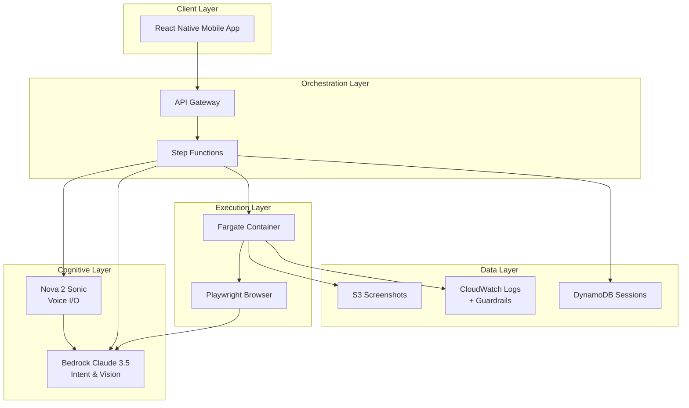

# Design Document: Bharat MatrixAI

## Overview

Bharat MatrixAI is a voice-first autonomous agent system built on a 4-pillar architecture that enables vernacular-speaking rural users to interact with English-heavy government portals. The system combines AWS AI services (Nova Sonic for voice, Bedrock Claude for cognition), computer vision-based web navigation, and asynchronous orchestration to provide a seamless voice-to-action experience.

The design prioritizes:
- **Resilience**: Vision-based navigation adapts to website changes without code updates
- **Privacy**: PII redaction at multiple layers using AWS Guardrails
- **Scalability**: Horizontal scaling through containerized browser instances
- **Cost Efficiency**: Optimized AI usage and resource management to maintain <$0.03 per transaction

## Architecture

### 4-Pillar Architecture



### Component Responsibilities

**Client Layer (React Native Mobile App)**:
- Captures voice input via device microphone
- Streams audio to backend via WebSocket or HTTP
- Plays synthesized voice responses
- Displays optional visual feedback (task status, extracted data)
- Handles offline scenarios with queued requests

**Orchestration Layer (API Gateway + Step Functions)**:
- API Gateway: REST endpoints for task submission, status checks, results retrieval
- Step Functions: Orchestrates the multi-step workflow (voice → intent → navigation → extraction → synthesis)
- Manages asynchronous task execution with callback notifications
- Handles retries and error recovery
- Maintains task state in DynamoDB

**Cognitive Layer (Bedrock + Nova)**:
- Nova 2 Sonic: Transcribes vernacular speech to text and synthesizes text to speech
- Bedrock Claude 3.5 Sonnet: 
  - Intent extraction and cognitive routing
  - Vision analysis of screenshots for navigation decisions
  - Information extraction from scraped content
  - Natural language generation for responses

**Execution Layer (Fargate + Playwright)**:
- Fargate: Containerized compute for browser automation
- Playwright: Headless browser automation with screenshot capture
- Executes navigation plans from cognitive layer
- Captures screenshots at each step for vision analysis
- Extracts final results from portal pages

**Advanced Error Handling in Execution Layer**:

The AWS Fargate container implements sophisticated retry logic to handle the unreliable nature of government portals. When a portal's DOM fails to load within 10 seconds, the system employs exponential backoff with the following strategy:

- **Initial Timeout**: 10 seconds for page load detection
- **Retry Attempts**: Maximum of 3 attempts with exponential backoff (10s → 20s → 40s)
- **Network Idle State**: Playwright waits for the `networkidle` state before capturing screenshots, ensuring all dynamic content, lazy-loaded images, and JavaScript-rendered elements are fully rendered before Claude Vision analyzes the page
- **Failure Escalation**: After 3 failed attempts, the system switches to asynchronous mode and notifies the user via their preferred channel

This approach ensures resilience against slow government servers, network congestion, and heavy JavaScript rendering common in legacy portal architectures.

**Data Layer**:
- S3: Temporary storage for screenshots (lifecycle policy: 24h deletion)
- DynamoDB: Task session state, user preferences, portal configurations
- CloudWatch Logs: Application logs with PII redaction via Guardrails

## Components and Interfaces

### Voice Input Module

**Technology**: AWS Nova 2 Sonic (Multimodal Speech-to-Text)

**Interface**:
```typescript
interface VoiceInputModule {
  transcribe(audioStream: AudioStream, language: VernacularLanguage): Promise<TranscriptionResult>
  detectLanguage(audioStream: AudioStream): Promise<VernacularLanguage>
}

interface TranscriptionResult {
  text: string
  confidence: number
  language: VernacularLanguage
  duration: number
}

type VernacularLanguage = 
  | 'hi' // Hindi
  | 'mr' // Marathi
  | 'ta' // Tamil
  | 'te' // Telugu
  | 'bn' // Bengali
  | 'gu' // Gujarati
  | 'kn' // Kannada
  | 'ml' // Malayalam
  | 'pa' // Punjabi
  | 'or' // Odia
```

**Implementation Details**:
- Streams audio chunks to Nova Sonic API
- Applies noise reduction preprocessing for rural environments
- Returns confidence scores to trigger re-prompting on low confidence
- Supports continuous listening mode for multi-turn conversations

### Cognitive Router

**Technology**: AWS Bedrock Claude 3.5 Sonnet

**Interface**:
```typescript
interface CognitiveRouter {
  extractIntent(transcribedText: string, language: VernacularLanguage): Promise<Intent>
  identifyPortal(intent: Intent): Promise<PortalConfig>
  extractParameters(transcribedText: string, requiredParams: ParameterSchema[]): Promise<Parameters>
  generateClarificationQuestion(missingParams: string[], language: VernacularLanguage): Promise<string>
}

interface Intent {
  category: string // e.g., "ration_card_status", "land_records", "pension_check"
  confidence: number
  extractedEntities: Record<string, string>
}

interface PortalConfig {
  portalId: string
  portalUrl: string
  navigationStrategy: NavigationStrategy
  requiredParameters: ParameterSchema[]
}

interface ParameterSchema {
  name: string
  type: 'text' | 'date' | 'number' | 'id'
  required: boolean
  validationPattern?: string
}

type Parameters = Record<string, string | number | Date>
```

**Implementation Details**:
- Uses few-shot prompting with vernacular examples for intent extraction
- Maintains portal registry in DynamoDB with intent-to-portal mappings
- Extracts structured parameters using Claude's function calling capability
- Generates contextual clarification questions in vernacular language

### Vision Analyzer

**Technology**: AWS Bedrock Claude 3.5 Sonnet (Vision)

**Interface**:
```typescript
interface VisionAnalyzer {
  analyzeScreenshot(screenshot: Buffer, navigationGoal: string): Promise<NavigationAction>
  extractInformation(screenshot: Buffer, extractionGoal: string): Promise<ExtractedData>
  identifyElements(screenshot: Buffer): Promise<UIElement[]>
}

interface NavigationAction {
  action: 'click' | 'type' | 'scroll' | 'wait' | 'extract'
  coordinates?: { x: number, y: number }
  text?: string
  confidence: number
  reasoning: string
}

interface UIElement {
  type: 'button' | 'input' | 'link' | 'dropdown' | 'table' | 'text'
  boundingBox: { x: number, y: number, width: number, height: number }
  label: string
  confidence: number
}

interface ExtractedData {
  structuredData: Record<string, any>
  rawText: string
  confidence: number
}
```

**Implementation Details**:
- Sends screenshots to Claude Vision with navigation goals
- Returns precise X/Y coordinates for clicking (resilient to DOM changes)
- Identifies form fields, buttons, and interactive elements
- Extracts tabular data and text content from result pages
- Uses chain-of-thought prompting for complex navigation decisions

### DOM Navigator

**Technology**: Playwright (Python) on AWS Fargate

**Interface**:
```python
from typing import Protocol, List
from dataclasses import dataclass

class DOMNavigator(Protocol):
    async def navigate_to_portal(self, portal_url: str) -> None: ...
    async def execute_action(self, action: NavigationAction) -> Screenshot: ...
    async def capture_screenshot(self) -> Screenshot: ...
    async def extract_page_content(self) -> str: ...
    async def close_session(self) -> None: ...

@dataclass
class Screenshot:
    image_data: bytes
    timestamp: float
    page_url: str
    viewport_size: tuple[int, int]
```

**Implementation Details**:
- Launches headless Chromium browser via Playwright
- Executes coordinate-based clicks from Vision Analyzer
- Handles page load waits (up to 15 seconds)
- Captures full-page screenshots at each navigation step
- Manages browser lifecycle (launch, navigate, close)
- Implements retry logic for transient failures

### Voice Output Module

**Technology**: AWS Nova 2 Sonic (Text-to-Speech)

**Interface**:
```typescript
interface VoiceOutputModule {
  synthesize(text: string, language: VernacularLanguage, voice: VoiceProfile): Promise<AudioStream>
  formatForSpeech(data: ExtractedData, language: VernacularLanguage): Promise<string>
}

interface VoiceProfile {
  gender: 'male' | 'female'
  speed: number // 0.5 to 2.0
  pitch: number // -20 to 20
}

type AudioStream = ReadableStream<Uint8Array>
```

**Implementation Details**:
- Converts extracted data to natural language narratives
- Breaks long content into digestible segments with pauses
- Applies prosody for better comprehension
- Supports all 10 vernacular languages
- Streams audio back to mobile client

### Orchestration Engine

**Technology**: AWS Step Functions

**State Machine Flow**:
```json
{
  "StartAt": "TranscribeVoice",
  "States": {
    "TranscribeVoice": {
      "Type": "Task",
      "Resource": "arn:aws:lambda:function:transcribe",
      "Next": "ExtractIntent"
    },
    "ExtractIntent": {
      "Type": "Task",
      "Resource": "arn:aws:lambda:function:cognitive-router",
      "Next": "CheckParameters"
    },
    "CheckParameters": {
      "Type": "Choice",
      "Choices": [
        {
          "Variable": "$.parametersComplete",
          "BooleanEquals": false,
          "Next": "AskClarification"
        }
      ],
      "Default": "NavigatePortal"
    },
    "AskClarification": {
      "Type": "Task",
      "Resource": "arn:aws:lambda:function:generate-question",
      "Next": "WaitForUserResponse"
    },
    "WaitForUserResponse": {
      "Type": "Task",
      "Resource": "arn:aws:states:waitForTaskToken",
      "Next": "ExtractIntent"
    },
    "NavigatePortal": {
      "Type": "Task",
      "Resource": "arn:aws:ecs:runTask:fargate",
      "Next": "ExtractInformation"
    },
    "ExtractInformation": {
      "Type": "Task",
      "Resource": "arn:aws:lambda:function:extract-data",
      "Next": "SynthesizeResponse"
    },
    "SynthesizeResponse": {
      "Type": "Task",
      "Resource": "arn:aws:lambda:function:voice-output",
      "End": true
    }
  }
}
```

**Implementation Details**:
- Manages end-to-end workflow from voice input to voice output
- Handles asynchronous execution with task tokens
- Implements retry policies for transient failures
- Stores task state in DynamoDB for status queries
- Triggers SNS notifications for task completion

## Data Models

### Task Session

```typescript
interface TaskSession {
  sessionId: string
  userId: string
  status: 'pending' | 'processing' | 'completed' | 'failed'
  createdAt: Date
  updatedAt: Date
  
  // Input
  voiceInput: {
    audioUrl: string
    transcription: string
    language: VernacularLanguage
  }
  
  // Intent
  intent: Intent
  portalConfig: PortalConfig
  parameters: Parameters
  
  // Execution
  navigationSteps: NavigationStep[]
  screenshots: string[] // S3 URLs
  
  // Output
  extractedData: ExtractedData
  responseText: string
  responseAudioUrl: string
  
  // Metadata
  costBreakdown: CostBreakdown
  duration: number
  errorLog?: string
}

interface NavigationStep {
  stepNumber: number
  action: NavigationAction
  screenshotUrl: string
  timestamp: Date
  success: boolean
}

interface CostBreakdown {
  transcriptionCost: number
  intentExtractionCost: number
  visionAnalysisCost: number
  computeCost: number
  synthesisCost: number
  totalCost: number
}
```

### Portal Configuration

```typescript
interface PortalConfiguration {
  portalId: string
  name: string
  url: string
  category: string
  
  // Intent Mapping
  intentKeywords: Record<VernacularLanguage, string[]>
  
  // Parameters
  requiredParameters: ParameterSchema[]
  
  // Navigation Hints
  navigationHints: {
    expectedSteps: number
    commonSelectors: Record<string, string>
    waitConditions: string[]
  }
  
  // Metadata
  averageCompletionTime: number
  successRate: number
  lastUpdated: Date
  active: boolean
}
```

### User Profile

```typescript
interface UserProfile {
  userId: string
  phoneNumber: string
  preferredLanguage: VernacularLanguage
  voiceProfile: VoiceProfile
  
  // History
  taskHistory: string[] // sessionIds
  frequentIntents: string[]
  
  // Preferences
  asyncThreshold: number // seconds before offering async
  notificationChannel: 'voice' | 'sms' | 'both'
  
  // Privacy
  dataRetentionDays: number
  piiRedactionEnabled: boolean
}
```


## Correctness Properties

*A property is a characteristic or behavior that should hold true across all valid executions of a system—essentially, a formal statement about what the system should do. Properties serve as the bridge between human-readable specifications and machine-verifiable correctness guarantees.*

### Voice Input Properties

**Property 1: Transcription accuracy and latency**
*For any* valid audio input in a supported vernacular language, the Voice_Input_Module should transcribe the speech with >90% accuracy and complete processing within 3 seconds of speech completion.
**Validates: Requirements 1.1, 1.3**

**Property 2: Noise handling**
*For any* audio input with background noise exceeding acceptable thresholds, the Voice_Input_Module should apply noise reduction before transcription.
**Validates: Requirements 1.5**

**Property 3: Poor quality audio handling**
*For any* audio input with poor quality or unclear speech (confidence <70%), the Voice_Input_Module should request the user to repeat their input.
**Validates: Requirements 1.2**

**Property 4: Multi-turn context preservation**
*For any* multi-turn conversation sequence, the Voice_Input_Module should maintain listening state and context across all turns without requiring re-initialization.
**Validates: Requirements 1.4**

### Cognitive Routing Properties

**Property 5: Intent classification accuracy**
*For any* transcribed vernacular text representing a valid intent, the Cognitive_Router should identify the target portal with >95% accuracy.
**Validates: Requirements 2.1**

**Property 6: Parameter extraction and clarification**
*For any* intent requiring specific parameters, the Cognitive_Router should either extract all required parameters from the input OR ask clarifying questions in the user's vernacular language for missing parameters.
**Validates: Requirements 2.2, 2.3**

**Property 7: Portal disambiguation**
*For any* intent that could map to multiple portals, the Cognitive_Router should select the most appropriate portal based on user context and intent specificity, with selection reasoning logged.
**Validates: Requirements 2.5**

### Navigation Properties

**Property 8: Browser navigation with screenshot capture**
*For any* portal target and parameter set, the DOM_Navigator should launch a browser session, navigate to the portal URL, and capture screenshots at each navigation step.
**Validates: Requirements 3.1, 3.6**

**Property 9: Form field identification and filling**
*For any* web page containing form fields, the System should identify each field's purpose using Vision_Analyzer and input the appropriate parameter value.
**Validates: Requirements 3.2**

**Property 10: Interactive element handling**
*For any* web page containing interactive elements (buttons, links, dropdowns), the System should determine the correct element to interact with and execute coordinate-based clicks.
**Validates: Requirements 3.3**

**Property 11: Page load timeout handling**
*For any* portal page that takes longer than 15 seconds to load, the System should wait for page completion before proceeding with navigation.
**Validates: Requirements 3.4**

**Property 12: UI change resilience**
*For any* portal whose structure changes (layout modifications, moved elements), the System should adapt navigation using Vision_Analyzer and successfully complete the task without code updates.
**Validates: Requirements 3.7**

### Vision Analysis Properties

**Property 13: Element identification with coordinates**
*For any* screenshot, the Vision_Analyzer should identify all interactive elements with their purposes AND return precise X/Y coordinates that fall within the actual element boundaries.
**Validates: Requirements 4.1, 4.2**

**Property 14: Low confidence handling**
*For any* screenshot where the Vision_Analyzer cannot identify the required element with >80% confidence, the System should request human guidance rather than proceeding with uncertain actions.
**Validates: Requirements 4.3**

**Property 15: UI pattern recognition**
*For any* portal design, the Vision_Analyzer should recognize common UI patterns (forms, tables, buttons, navigation menus) regardless of specific styling or layout.
**Validates: Requirements 4.4**

**Property 16: Information extraction accuracy**
*For any* portal page containing relevant information, the Vision_Analyzer should extract text content with >95% accuracy when compared to ground truth.
**Validates: Requirements 4.5**

### Information Extraction Properties

**Property 17: Complete information extraction**
*For any* completed portal navigation, the System should extract all information fields that match the user's original intent.
**Validates: Requirements 5.1**

**Property 18: Tabular data structure preservation**
*For any* extracted tabular data, the System should preserve the structure and relationships between data elements (rows, columns, headers).
**Validates: Requirements 5.2**

**Property 19: Natural language formatting**
*For any* extracted data, the System should format it into natural language text suitable for voice synthesis.
**Validates: Requirements 5.3**

**Property 20: Technical term translation**
*For any* extracted information containing technical terms or English text, the System should translate it to the user's vernacular language.
**Validates: Requirements 5.4**

**Property 21: Incomplete extraction notification**
*For any* information extraction that fails or returns incomplete data, the System should inform the user of the specific missing information in their vernacular language.
**Validates: Requirements 5.5**

### Voice Output Properties

**Property 22: Vernacular speech synthesis**
*For any* result to communicate, the Voice_Output_Module should synthesize speech in the user's vernacular language matching their profile.
**Validates: Requirements 6.1**

**Property 23: Content segmentation**
*For any* complex information exceeding 100 words, the Voice_Output_Module should break content into digestible segments with appropriate pauses between segments.
**Validates: Requirements 6.3**

**Property 24: Language parity**
*For any* vernacular language supported by Voice_Input_Module, the Voice_Output_Module should also support synthesis in that language.
**Validates: Requirements 6.4**

**Property 25: Response replay**
*For any* user request for repetition, the Voice_Output_Module should replay the previous response with identical content.
**Validates: Requirements 6.5**

### Asynchronous Processing Properties

**Property 26: Async mode triggering**
*For any* task session expected to exceed 30 seconds, the System should offer asynchronous processing with callback notification to the user.
**Validates: Requirements 7.1**

**Property 27: Task identifier generation**
*For any* asynchronous task, the System should provide the user with a unique task reference identifier.
**Validates: Requirements 7.2**

**Property 28: Async completion notification**
*For any* asynchronous task that completes, the System should notify the user via their preferred notification channel (voice, SMS, or both).
**Validates: Requirements 7.3**

**Property 29: State persistence across disconnections**
*For any* task session, the System should maintain session state across disconnections and reconnections, allowing users to resume from the same point.
**Validates: Requirements 7.4**

**Property 30: Status reporting in vernacular**
*For any* user status check query, the System should provide progress updates in the user's vernacular language.
**Validates: Requirements 7.5**

### Privacy and Security Properties

**Property 31: PII redaction in logs**
*For any* log entry, the System should redact all PII (names, addresses, phone numbers, ID numbers, dates of birth) before writing to CloudWatch.
**Validates: Requirements 8.1**

**Property 32: Comprehensive encryption**
*For any* user data, the System should encrypt it in transit using TLS 1.3+ AND encrypt it at rest using AES-256.
**Validates: Requirements 8.2, 8.3**

**Property 33: Temporary data cleanup**
*For any* completed task session, the System should delete all temporary data (screenshots, browser session data) within 24 hours.
**Validates: Requirements 8.4**

**Property 34: Voice recording deletion**
*For any* voice recording, the System should delete it immediately after transcription is complete.
**Validates: Requirements 8.5**

**Property 35: Conservative PII redaction**
*For any* content where PII redaction is uncertain, the System should err on the side of caution and redact the questionable content.
**Validates: Requirements 8.6**

### Scalability Properties

**Property 36: Concurrent session isolation**
*For any* set of concurrent user sessions navigating different portals, the System should ensure no interference between sessions (no shared state, no resource conflicts).
**Validates: Requirements 9.2**

**Property 37: Hot configuration reload**
*For any* portal configuration update, the System should apply changes to new task sessions without requiring system restart.
**Validates: Requirements 9.5**

### Cost Efficiency Properties

**Property 38: Cost threshold compliance with monitoring**
*For any* task session, the System should complete the transaction for less than $0.03 in infrastructure costs AND alert administrators if costs exceed this threshold.
**Validates: Requirements 10.1, 10.5**

**Property 39: Intent pattern caching**
*For any* common intent pattern that has been processed before, the System should use cached cognitive routing results to reduce AI model API calls.
**Validates: Requirements 10.2**

**Property 40: Browser session cleanup**
*For any* completed task, the System should terminate the browser session immediately to minimize compute costs.
**Validates: Requirements 10.3**

**Property 41: Result caching**
*For any* portal information request that matches a previous request within a 5-minute time window, the System should cache and reuse results rather than re-navigating.
**Validates: Requirements 10.4**

### Error Handling Properties

**Property 42: Vernacular error explanations**
*For any* portal navigation failure, the System should provide the user with a clear explanation in their vernacular language describing what went wrong.
**Validates: Requirements 11.1**

**Property 43: Diagnostic logging with privacy**
*For any* system error, the System should log sufficient diagnostic information for troubleshooting while maintaining PII redaction.
**Validates: Requirements 11.2**

**Property 44: Portal unavailability handling**
*For any* portal that is temporarily unavailable (timeout, 5xx errors), the System should inform the user and offer to retry or schedule the task for later.
**Validates: Requirements 11.3**

**Property 45: Fallback options**
*For any* task that the System cannot complete autonomously, the System should provide the user with alternative options (human assistance, simplified guidance).
**Validates: Requirements 11.5**

### Conversation Management Properties

**Property 46: Follow-up questions in vernacular**
*For any* situation where the System needs additional information, the System should ask follow-up questions in the user's vernacular language.
**Validates: Requirements 12.1**

**Property 47: Context integration across turns**
*For any* multi-turn conversation, the System should maintain context across voice exchanges AND integrate new information with previously captured intent and parameters.
**Validates: Requirements 12.2, 12.3**

**Property 48: Conversation repair**
*For any* user correction of previously stated information, the System should update its understanding and adjust the task parameters accordingly.
**Validates: Requirements 12.4**

**Property 49: State rollback**
*For any* user command to "go back" (or vernacular equivalent), the System should return to the previous conversation state.
**Validates: Requirements 12.5**

## Error Handling

### Error Categories

**1. User Input Errors**
- Unrecognized language or dialect
- Extremely poor audio quality (unrecoverable)
- Ambiguous or nonsensical intent
- Missing critical parameters after multiple clarification attempts

**Handling Strategy**: Provide clear vernacular explanation, offer examples of valid requests, escalate to human assistance if needed.

**2. Portal Navigation Errors**
- Portal unavailable (timeout, DNS failure, 5xx errors)
- CAPTCHA or authentication challenges
- Unexpected page structure (Vision_Analyzer confidence <80%)
- Required information not found on portal

**Handling Strategy**: Inform user of specific issue, offer retry with exponential backoff, provide alternative portals if available, escalate to human assistance for CAPTCHAs.

**3. System Resource Errors**
- Browser launch failure
- Screenshot capture failure
- AI service rate limiting or quota exceeded
- Database connection failure

**Handling Strategy**: Automatic retry with exponential backoff (max 3 attempts), switch to async mode if synchronous fails, alert operations team, provide user with task reference for status checking.

**4. Data Quality Errors**
- Extraction confidence <95%
- Incomplete data extraction
- Translation failure
- PII redaction failure

**Handling Strategy**: Flag low-confidence results to user, provide partial results with caveats, offer human verification, err on side of caution for PII (redact if uncertain).

### Error Recovery Patterns

**Retry with Exponential Backoff**:
```python
async def retry_with_backoff(operation, max_attempts=3, base_delay=1.0):
    for attempt in range(max_attempts):
        try:
            return await operation()
        except RetryableError as e:
            if attempt == max_attempts - 1:
                raise
            delay = base_delay * (2 ** attempt)
            await asyncio.sleep(delay)
```

**Circuit Breaker for Portal Availability**:
```python
class PortalCircuitBreaker:
    def __init__(self, failure_threshold=5, timeout=60):
        self.failure_count = 0
        self.failure_threshold = failure_threshold
        self.timeout = timeout
        self.last_failure_time = None
        self.state = "closed"  # closed, open, half-open
    
    async def call(self, portal_operation):
        if self.state == "open":
            if time.time() - self.last_failure_time > self.timeout:
                self.state = "half-open"
            else:
                raise CircuitBreakerOpenError("Portal temporarily unavailable")
        
        try:
            result = await portal_operation()
            if self.state == "half-open":
                self.state = "closed"
                self.failure_count = 0
            return result
        except Exception as e:
            self.failure_count += 1
            self.last_failure_time = time.time()
            if self.failure_count >= self.failure_threshold:
                self.state = "open"
            raise
```

**Graceful Degradation**:
- If Vision_Analyzer fails, fall back to DOM selector-based navigation (less resilient but functional)
- If vernacular synthesis fails, fall back to English with apology
- If async notification fails, store result for user to poll

### Logging and Monitoring

**Structured Logging with PII Redaction**:
```python
import logging
from aws_guardrails import redact_pii

class PIIRedactingLogger:
    def __init__(self, logger_name):
        self.logger = logging.getLogger(logger_name)
    
    def log(self, level, message, **kwargs):
        redacted_message = redact_pii(message)
        redacted_kwargs = {k: redact_pii(str(v)) for k, v in kwargs.items()}
        self.logger.log(level, redacted_message, extra=redacted_kwargs)
```

**Metrics to Track**:
- Task completion rate (by portal, by intent category)
- Average task duration
- Cost per transaction
- AI service latency (transcription, intent extraction, vision analysis, synthesis)
- Error rates by category
- PII redaction effectiveness (manual audit sample)

## Testing Strategy

### Dual Testing Approach

This system requires both unit tests and property-based tests for comprehensive coverage:

**Unit Tests**: Focus on specific examples, edge cases, and integration points
- Specific portal navigation scenarios
- Known error conditions (CAPTCHA, timeout)
- Integration between components
- Configuration loading and validation

**Property-Based Tests**: Verify universal properties across all inputs
- Voice transcription accuracy across random audio samples
- Intent extraction across random vernacular phrases
- Vision analysis across random screenshots
- PII redaction across random log content
- Cost tracking across random task scenarios

### Property-Based Testing Configuration

**Framework**: Use `hypothesis` for Python components and `fast-check` for TypeScript components

**Configuration**:
- Minimum 100 iterations per property test (due to randomization)
- Each property test must reference its design document property
- Tag format: `# Feature: bharat-matrix-ai, Property {number}: {property_text}`

**Example Property Test Structure**:
```python
from hypothesis import given, strategies as st
import pytest

@given(
    audio=st.binary(min_size=1000, max_size=100000),
    language=st.sampled_from(['hi', 'mr', 'ta', 'te', 'bn', 'gu', 'kn', 'ml', 'pa', 'or'])
)
@pytest.mark.property_test
def test_transcription_accuracy_and_latency(audio, language):
    """
    Feature: bharat-matrix-ai, Property 1: Transcription accuracy and latency
    For any valid audio input in a supported vernacular language, 
    the Voice_Input_Module should transcribe with >90% accuracy 
    and complete within 3 seconds.
    """
    start_time = time.time()
    result = voice_input_module.transcribe(audio, language)
    duration = time.time() - start_time
    
    assert result.confidence > 0.90
    assert duration < 3.0
    assert result.language == language
```

### Test Data Generation

**Synthetic Audio Generation**:
- Use AWS Polly to generate synthetic vernacular speech for testing
- Add controlled noise levels for quality testing
- Generate multi-turn conversation sequences

**Portal Mocking**:
- Create mock HTML pages representing common portal patterns
- Simulate slow loading, timeouts, and errors
- Generate random form structures for navigation testing

**PII Test Data**:
- Generate synthetic PII (names, addresses, IDs) for redaction testing
- Use faker libraries with Indian locale
- Ensure test data covers all PII categories

### Integration Testing

**End-to-End Workflow Tests**:
1. Voice input → Intent extraction → Portal navigation → Information extraction → Voice output
2. Multi-turn conversation with clarification questions
3. Asynchronous task processing with callback
4. Error scenarios (portal unavailable, CAPTCHA, extraction failure)

**Component Integration Tests**:
- Voice_Input_Module → Cognitive_Router
- Cognitive_Router → DOM_Navigator
- DOM_Navigator → Vision_Analyzer
- Vision_Analyzer → Information_Extractor
- Information_Extractor → Voice_Output_Module

### Performance Testing

**Load Testing**:
- Simulate concurrent users (10, 50, 100, 500)
- Measure task completion time under load
- Verify cost per transaction remains <$0.03
- Ensure no session interference

**Latency Testing**:
- Measure each component's latency independently
- Identify bottlenecks in the workflow
- Verify end-to-end latency meets user expectations

### Security Testing

**PII Redaction Validation**:
- Manual audit of sample logs to verify no PII leakage
- Automated scanning for patterns (phone numbers, IDs, names)
- Test edge cases (partial redaction, ambiguous content)

**Encryption Validation**:
- Verify TLS 1.3 is enforced for all connections
- Verify AES-256 encryption for data at rest
- Test certificate validation and rotation

### Acceptance Testing

**User Acceptance Testing**:
- Test with actual rural users speaking vernacular languages
- Measure task completion success rate
- Gather qualitative feedback on voice quality and clarity
- Validate that explanations are understandable

**Portal Coverage Testing**:
- Test with real government portals
- Verify navigation success across different portal designs
- Test resilience to portal updates
- Measure extraction accuracy on real data

## Implementation Notes

### Technology Stack Summary

- **Mobile Client**: React Native (iOS/Android)
- **API Gateway**: AWS API Gateway (REST + WebSocket)
- **Orchestration**: AWS Step Functions
- **Voice I/O**: AWS Nova 2 Sonic
- **Cognitive AI**: AWS Bedrock Claude 3.5 Sonnet
- **Browser Automation**: Playwright (Python)
- **Compute**: AWS Fargate (containerized)
- **Storage**: S3 (screenshots), DynamoDB (sessions, config)
- **Logging**: CloudWatch with AWS Guardrails for PII redaction
- **Monitoring**: CloudWatch Metrics, X-Ray for tracing

### Key Design Decisions

**1. Vision-Based Navigation over DOM Selectors**
- **Rationale**: Government portals change frequently without notice. Vision-based coordinate clicking is resilient to HTML structure changes.
- **Trade-off**: Higher latency and cost per navigation step, but dramatically better reliability.

**2. Asynchronous Processing for Long Tasks**
- **Rationale**: Government portals can be extremely slow (15+ seconds per page). Keeping users on the line is poor UX.
- **Trade-off**: More complex state management, but better user experience.

**3. Containerized Browser Instances on Fargate**
- **Rationale**: Horizontal scalability without managing servers. Each task gets isolated browser environment.
- **Trade-off**: Higher cold start latency, but better isolation and scalability.

**4. PII Redaction at Multiple Layers**
- **Rationale**: Defense in depth. Redact at application layer AND use AWS Guardrails for CloudWatch.
- **Trade-off**: Some performance overhead, but critical for privacy compliance.

**5. Portal Configuration Registry**
- **Rationale**: Enable adding new portals without code changes. Configuration-driven approach.
- **Trade-off**: Requires careful configuration management, but enables rapid scaling.

### Future Enhancements

- **Offline Mode**: Cache common portal results for offline access
- **Multi-Modal Input**: Support text input alongside voice for users with speech difficulties
- **Proactive Notifications**: Alert users about expiring documents or upcoming deadlines
- **Voice Biometrics**: Authenticate users via voice for secure transactions
- **Regional Dialect Support**: Expand beyond standard vernacular to regional dialects
- **Video Guidance**: Provide video tutorials for complex tasks
